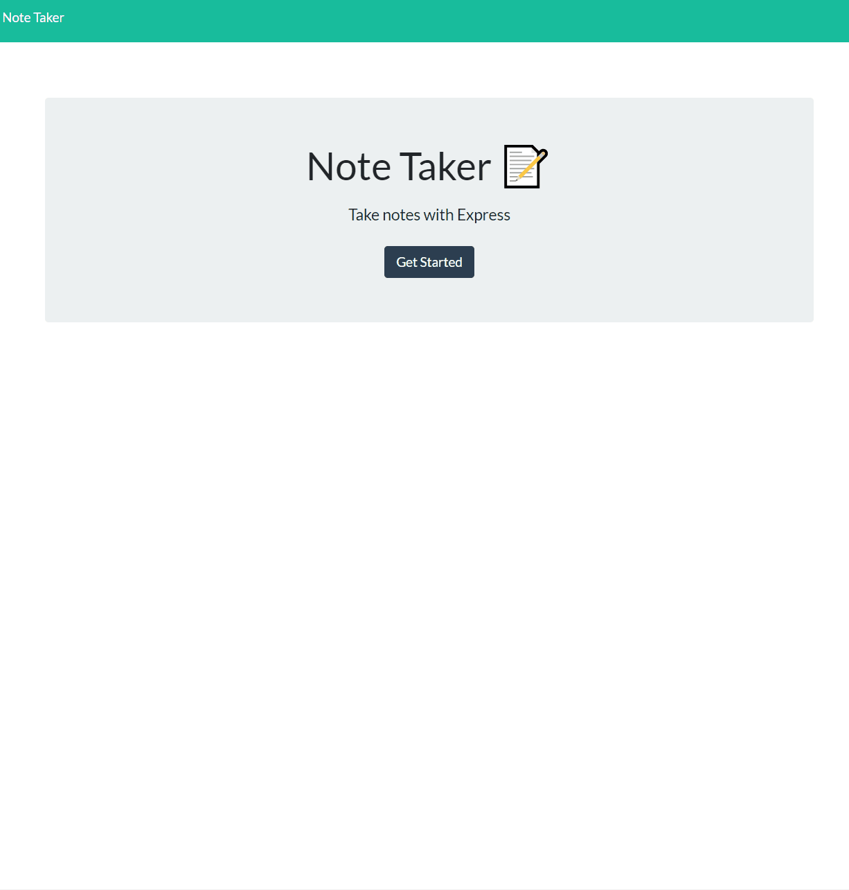

# Note Taker
  

  ## Description
  This application is a basic note taker that allows the user to add notes with a title and text body. The notes can be saved and are accesible to view. A feature for future implementaion would be the ability to delete a note from the notes page.

  In this assignment, I was given starter code that was missing back-end function. This was an exercise in deploying express.js techniques to set up routes in order for the client and server to communicate.

  This project utilizes Node.js and Express.js for its framework.

  ## Table of Contents
  * [Installation](#installation)
  * [Usage](#usage)
  * [License](#license)
  * [Credits](#credits)

  ## Installation
  To install dependencies, use the command `npm i`.
  
  ## Usage
  Once the page is loaded, click the 'getting started' button to be taken to the notes page. There is a + button in the upper right corner of the page. This button loads a blank note template that the user can fill out. Once the title and text have been added, there is a save button next to the + button that will save the note on the left column of the application. These notes can be clicked on to be displayed to the user.
  

  
## License

This project is licensed under the [MIT](https://opensource.org/licenses/MIT) license.

## Credits

